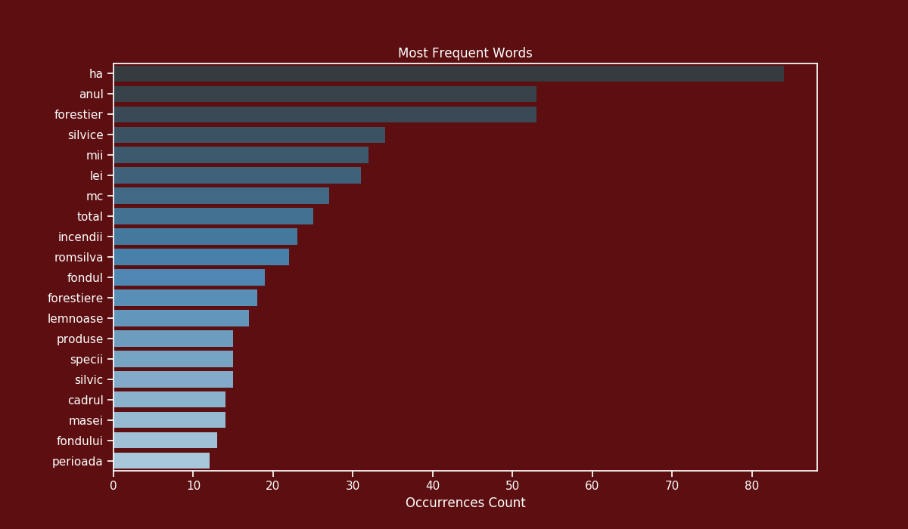

# Forest Status Report Romania

In this repository, we extract text from PDF file reports, process it and after push it into Spacy pipeline for name entity extraction.
Afterwards, the extracted results are printed in a map.

## Requirements

This project uses the following Python libraries

* `PyPDF2`
* `spaCy` : Used for name entity extraction in Romanian
* `NumPy` : Used for matrix multiplication
* `pandas` : Data analytcs tool
* `matplotlib` : Creating plots tool
* `seaborn` : Creating plots tool
* `geopandas` : Ploting maps tool

## Word counts

THe plot bellow represents the moust frequent words used in a document.

## Mentions per county

The plot bellow represents how many times the name of each county appears in the document. This can be viewed as a metric which outputs the counties which have the biggest problems with deforestation.

