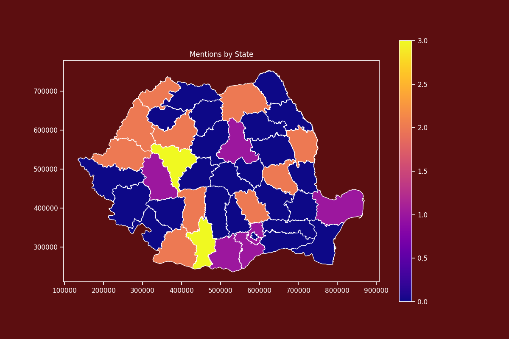

# Forest Status Report Romania

In this repository, we extract text from PDF file reports, process it and after push it into Spacy pipeline for name entity extraction.
Afterwards, the extracted results are printed in a map.

## Requirements

This project uses the following Python libraries

* `PyPDF2`
* `spaCy` : Used for name entity extraction in Romanian
* `NumPy` : Used for matrix multiplication
* `pandas` : Data analytcs tool
* `matplotlib` : Creating plots tool
* `seaborn` : Creating plots tool
* `geopandas` : Ploting maps tool

## Results

The number of each countie from the documents is ploted in a map.

